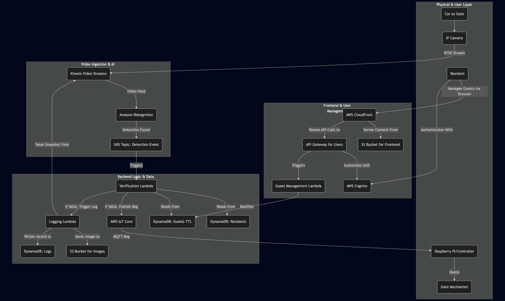

# GateUP - Infrastructure as Code

This repository contains the Terraform code to provision and manage the entire AWS infrastructure for the GateUP project. It defines all the necessary cloud resources, including networking, databases, and serverless compute, in a modular and reusable way.

The application code for this project is managed in a separate repository: [**GateUP Application**](https://github.com/liormilliger/GateUP).

---

## Architecture

The project is built on a serverless, event-driven architecture on AWS. The following diagram illustrates the flow of data from the camera to the gate-opening mechanism.



---

## Infrastructure Deployment

This guide explains how to use Terraform to deploy the cloud infrastructure from your local machine.

### Prerequisites

Before you begin, ensure you have the following installed and configured:

* **Terraform:** [Installation Guide](https://www.terraform.io/downloads.html) (Version >= 1.0)
* **AWS CLI:** [Installation Guide](https://docs.aws.amazon.com/cli/latest/userguide/cli-chap-install.html)
* **AWS Credentials:** Your AWS CLI must be configured with credentials that have sufficient permissions to create the resources. You can configure this by running:
    ```bash
    aws configure
    ```

### Deployment Steps

The Terraform configuration is organized into environments. All commands should be run from the `environments/dev` directory.

1.  **Backend Setup (One-Time Manual Step):**
    Terraform uses a remote S3 bucket to store its state file and a DynamoDB table for state locking. You must create these two resources manually in your AWS account one time.
    * **S3 Bucket:** Create a bucket (e.g., `liorm-gateup`).
    * **DynamoDB Table:** Create a table named `terraform-state-locks` with a primary key `LockID` (Type: String).

2.  **Initialize Terraform:**
    Navigate to the development environment directory and run `terraform init`. This will configure your backend and download the necessary provider plugins.
    ```bash
    cd environments/dev
    terraform init
    ```

3.  **Plan the Deployment:**
    Run `terraform plan` to see a preview of all the AWS resources that will be created. This is a dry run and will not make any changes.
    ```bash
    terraform plan
    ```

4.  **Apply the Configuration:**
    If the plan looks correct, apply it to create the infrastructure in your AWS account.
    ```bash
    terraform apply
    ```
    Terraform will ask for confirmation before proceeding. Type `yes` to approve.

### Modular Structure

This project uses a modular design to promote reusability and maintainability. The core components are defined in separate modules located in the `modules/` directory:

* **VPC:** Creates the foundational networking layer.
* **Database:** Provisions all necessary DynamoDB tables.
* **IAM:** Manages IAM roles and policies for Lambda functions.
* **Rekognition:** Sets up the Kinesis Video Stream and SNS topic.
* **Verification-Lambda:** Defines the Lambda function and triggers for processing the video stream.

